# tableau2pbir

Deterministic converter from Tableau workbooks (`.twb` / `.twbx`) to Power BI projects in PBIR format.

## Pipeline Overview

```mermaid
flowchart TD
    A([.twb / .twbx]) --> S1

    subgraph S1["Stage 1 — Extract (pure Python)"]
        direction LR
        s1a["Parse XML / unzip .twbx"]
        s1b["Extract: datasources, worksheets,\ndashboards, calcs, filters"]
    end

    S1 --> S2

    subgraph S2["Stage 2 — Canonicalize → IR (pure Python)"]
        direction LR
        s2a["Normalize calc kinds\n(row / LOD / table_calc / parameter)"]
        s2b["Classify connectors (Tier 1–4)"]
        s2c["Resolve parameter intents"]
        s2d["Populate unsupported[] entries"]
    end

    S2 --> S3

    subgraph S3["Stage 3 — Translate Calcs (Python rules + AI fallback)"]
        direction LR
        s3a["Rule library: SUM/AVG/COUNT/MIN/MAX,\nIF/IIF/ZN/IFNULL, DATEPART/DATEDIFF,\nLOD FIXED, running total …"]
        s3b["AI fallback for unmatched exprs\n(confidence: high/medium/low)"]
        s3c["Emit dax_expr per calculation"]
    end

    S3 --> S4

    subgraph S4["Stage 4 — Map Visuals (Python dispatch + AI fallback)"]
        direction LR
        s4a["Dispatch table:\nBar→clusteredBarChart\nLine→lineChart\nArea→areaChart\nCircle→scatterChart\nPie→pieChart\nText→tableEx\nMap→filledMap"]
        s4b["AI fallback for ambiguous /\ndual-axis mark combos"]
        s4c["Validate encoding bindings"]
    end

    S4 --> S5

    subgraph S5["Stage 5 — Compute Layout (pure Python)"]
        direction LR
        s5a["Walk Tableau container tree"]
        s5b["Compute pixel positions\nfor tiled + floating zones"]
        s5c["Resolve relative-sized sheets\nto absolute coordinates"]
    end

    S5 --> S6

    subgraph S6["Stage 6 — Build TMDL (pure Python)"]
        direction LR
        s6a["Emit Model.tmdl,\nTable.tmdl per datasource"]
        s6b["Write DAX measures,\ncalculated columns, relationships"]
        s6c["Map connector → M expression"]
    end

    S6 --> S7

    subgraph S7["Stage 7 — Build Report PBIR (pure Python)"]
        direction LR
        s7a["Emit report.json,\npage .json per dashboard"]
        s7b["Wire visual configs:\nencoding bindings, filters, format"]
        s7c["Emit .pbip entry point"]
    end

    S7 --> S8

    subgraph S8["Stage 8 — Package + Validate (pure Python)"]
        direction LR
        s8a["Compile via pbi-tools"]
        s8b["Validate TMDL with TabularEditor 2"]
        s8c["PBI Desktop open gate (≤ 300 s)"]
        s8d["Emit unsupported.json +\nworkbook-report.md"]
    end

    S8 --> Z([./out/<wb>/<wb>.pbip])

    style S1 fill:#e8f4fd,stroke:#2196F3
    style S2 fill:#e8f4fd,stroke:#2196F3
    style S3 fill:#fff3e0,stroke:#FF9800
    style S4 fill:#fff3e0,stroke:#FF9800
    style S5 fill:#e8f4fd,stroke:#2196F3
    style S6 fill:#e8f4fd,stroke:#2196F3
    style S7 fill:#e8f4fd,stroke:#2196F3
    style S8 fill:#e8f4fd,stroke:#2196F3
```



**Blue = pure Python (deterministic) · Orange = Python rules with AI fallback (Anthropic Claude)**

## Stage Reference

| # | Stage | Engine | Input | Output |
|---|-------|--------|-------|--------|
| 1 | **Extract** | Pure Python | `.twb` / `.twbx` | Raw XML tree |
| 2 | **Canonicalize → IR** | Pure Python | Raw XML tree | Normalized IR JSON |
| 3 | **Translate Calcs** | Python rules + AI | IR JSON | IR + `dax_expr` per calc |
| 4 | **Map Visuals** | Python dispatch + AI | IR JSON | IR + `pbir_visual` per sheet |
| 5 | **Compute Layout** | Pure Python | IR JSON | IR + pixel positions |
| 6 | **Build TMDL** | Pure Python | IR JSON | `SemanticModel/*.tmdl` |
| 7 | **Build Report PBIR** | Pure Python | IR JSON + TMDL | `Report/definition/*.json` |
| 8 | **Package + Validate** | Pure Python | All above | `.pbip` + reports |

Each stage emits:
- `stages/<n>_<name>.json` — handoff to the next stage
- `stages/<n>_<name>.summary.md` — human-readable per-stage summary

## Coverage

| Category | Supported | Partial | Unsupported |
|---|---|---|---|
| **Marks** | bar, line, area, scatter, pie, text-table, filled map | stacked area w/ mixed measures, symbol map | polygon, density, Gantt, custom shapes |
| **Calculations** | row calcs, SUM/AVG/COUNT, IF/IIF/ZN/IFNULL, DATEPART/DATEDIFF, LOD FIXED | LOD INCLUDE/EXCLUDE, running total, % of total, rank | R/Python script calcs, spatial calcs |
| **Filters** | categorical, range, top-N | context filters | conditional filters on table calcs |
| **Encodings** | color, size, label, tooltip, detail, shape, angle | dual-axis, custom palettes, viz-in-tooltip | — |
| **Dashboards** | tiled + floating, text, image, filter/parameter cards, nav button | relative-sized sheets, mobile layout | web-page object |
| **Data sources** | Tier 1 connectors (CSV, Excel, SQL Server, BigQuery …) | Tier 2/3 (credentials, degraded) | Tier 4 (forces `failed`) |

Unsupported objects are recorded in `unsupported.json` rather than aborting the run.

## Install (dev)

```bash
python -m venv .venv
source .venv/Scripts/activate    # bash on Windows
# or: .venv\Scripts\activate     # PowerShell
pip install -e ".[dev]"
```

Copy `.env.example` to `.env` and set your Anthropic key (required for AI fallback stages):

```bash
ANTHROPIC_API_KEY=sk-ant-...
```

## Usage

```bash
# Convert a workbook end-to-end
tableau2pbir convert path/to/workbook.twbx --out ./out/

# Stop after a specific stage for inspection
tableau2pbir convert path/to/workbook.twbx --out ./out/ --gate canonicalize

# Resume from a stage after hand-editing the JSON
tableau2pbir resume ./out/workbook/ --from translate_calcs
```

## Output Structure

```
./out/<wb>/
  <wb>.pbip                  # open in Power BI Desktop
  SemanticModel/             # TMDL semantic model files
  Report/definition/         # PBIR report JSON
  stages/
    01_extract.json
    01_extract.summary.md
    02_canonicalize.json
    ...
    08_package_validate.summary.md
  unsupported.json           # all unsupported objects across stages
  workbook-report.md         # human-readable conversion report
```

## Test

```bash
make test          # unit + contract + integration (snapshot replay, no API calls)
make test-v1.1     # includes v1.1-preview features
```

Integration tests that exercise real workbooks with AI stages require `ANTHROPIC_API_KEY` in `.env`.

## Design Spec

`docs/superpowers/specs/2026-04-23-tableau-to-pbir-design.md` — source of truth for architecture and IR schema.

## Implementation Status

| Plan | Stages | Status |
|------|--------|--------|
| 1 | Scaffolding & Infrastructure | ✅ Done |
| 2 | Stage 1 (Extract) + Stage 2 (Canonicalize → IR) | ✅ Done |
| 3 | Stage 3 (Calc Translation) + Stage 4 (Visual Mapping) | ✅ Done |
| 4 | Stage 5 (Layout) + Stage 6 (TMDL) + Stage 7 (PBIR Emission) | 🔲 Next |
| 5 | Stage 8 (Package, Validate & Desktop-Open Gate) | 🔲 Planned |
